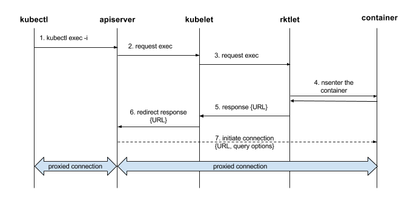

# Getting started

## Building rktlet

```shell
# In the rktlet repo's root dir.
$ make
go build -o bin/rktlet ./cmd/server/main.go
```

## Configure Kubernetes to use rktlet

Assuming the rktlet process is running with the default configuration you need to pass the following options to the Kubelet:

```
--cgroup-driver=systemd \
--container-runtime=remote \
--container-runtime-endpoint=/var/run/rktlet.sock \
--image-service-endpoint=/var/run/rktlet.sock
```

### Configure stream server address

For some operations (e.g. `kubectl exec`) the kubelet sends a streaming request to rktlet and rktlet generates a URL that is sent to the API server.
Then, the API server will connect to that URL to carry out the requested operation.



For this to work, rktlet needs to know on which address to listen for streaming requests.
This address must be reachable from the master node (running the API server).

You can specify the address with the rktlet flag `--stream-server-address`.
For example, assuming the IP of the node where the rktlet is running is `192.168.1.100` and that IP address is reachable from the master node, you can execute rktlet as follows.

```
# rktlet --stream-server-address=192.168.1.100:10241
```

## Use rktlet in kube-spawn

kube-spawn is a tool for creating multi-node Kubernetes clusters on Linux with each node being a system-nspawn container.

**Note:** This guide assumes kube-spawn v0.2.0 and a built [rkt](https://github.com/rkt/rkt).

First, create a cluster configuration with rkt.
Substitute the paths for rkt, rkt's stage1, and rktlet with the ones on your machine.

```shell
$ export CNI_PATH=$GOPATH/bin
$ sudo -E KUBE_SPAWN_RKT_BIN=$GOPATH/bin/rkt \
          KUBE_SPAWN_RKT_STAGE1_IMAGE=$GOPATH/bin/stage1-coreos.aci \
          KUBE_SPAWN_RKTLET_BIN=$GOPATH/bin/rktlet \
          kube-spawn create --container-runtime=rkt
creating cluster environment "default"
spawning kubernetes version "v1.7.5"
spawning with container runtime "rkt"
ensuring environment
{
    "cniVersion": "0.2.0",
    "ip4": {
        "ip": "10.22.3.135/16",
        "gateway": "10.22.0.1",
        "routes": [
            {
                "dst": "0.0.0.0/0",
                "gw": "10.22.0.1"
            }
        ]
    },
    "dns": {}
}checking base image
making iptables FORWARD chain defaults to ACCEPT...
setting iptables rule to allow CNI traffic...
generating scripts
copy files into environment
created cluster config
```

Let's start the cluster now!

```shell
$ sudo -E kube-spawn start
using config from /var/lib/kube-spawn/default
using "coreos" base image from /var/lib/machines
spawning cluster "default" (2 machines)
Image resized.
Resize '/var/lib/machines' of 'max'
waiting for machine "kubespawndefault0" to start up
waiting for machine "kubespawndefault1" to start up
machine "kubespawndefault0" started
bootstrapping "kubespawndefault0"
machine "kubespawndefault1" started
bootstrapping "kubespawndefault1"
cluster "default" started
[!] note: init on master can take a couple of minutes until all pods are up
Connected to machine kubespawndefault0. Press ^] three times within 1s to exit session.
[kubeadm] WARNING: kubeadm is in beta, please do not use it for production clusters.
[init] Using Kubernetes version: v1.7.5
[init] Using Authorization modes: [Node RBAC]
[preflight] Skipping pre-flight checks

[...]

cluster "default" initialized
```

Now you can access the cluster and schedule pods:

```
$ kubectl get nodes
NAME                STATUS    ROLES     AGE       VERSION
kubespawndefault0   Ready     master    2m        v1.7.5
kubespawndefault1   Ready     <none>    2m        v1.7.5
$ kubectl run nginx --image=nginx
deployment "nginx" created
$ kubectl get pods
NAME                     READY     STATUS    RESTARTS   AGE
nginx-4217019353-bfmzp   1/1       Running   0          22s
```

## Use rktlet in a local cluster

* Start rktlet:

```shell
# After building rktlet, in the rktlet repo's root dir.
$ sudo ./bin/rktlet -v=4
...
```

By default, the `rktlet` service will listen on a unix socket `/var/run/rktlet.sock`.

* Start a local cluster and set the container runtime type == `remote`, and tell kubelet where to contact the remote runtime.

```shell
# In the Kubernetes repo's root dir.
$ export LOG_LEVEL=6
$ export CGROUP_DRIVER=systemd
$ export CONTAINER_RUNTIME=remote
$ export CONTAINER_RUNTIME_ENDPOINT=/var/run/rktlet.sock
$ export IMAGE_SERVICE_ENDPOINT=/var/run/rktlet.sock
$ ./hack/local-up-cluster.sh
...
To start using your cluster, open up another terminal/tab and run:

  export KUBERNETES_PROVIDER=local

  cluster/kubectl.sh config set-cluster local --server=http://127.0.0.1:8080 --insecure-skip-tls-verify=true
  cluster/kubectl.sh config set-context local --cluster=local
  cluster/kubectl.sh config use-context local
  cluster/kubectl.sh

```

* Now we are able to launch pods:

```shell
$ kubectl create -f examples/pod
pod "nginx" created

$ kubectl get pods
NAME      READY     STATUS    RESTARTS   AGE
nginx     1/1       Running   0          57s
```

## Using the rkt cli

By default, `rktlet` will configure rkt to use a data directory in
`/var/lib/rktlet/data`. It may be convenient to create a wrapper script to
interact with this data directory.

To view `rktlet` started pods and applications, the following commands might help

```shell
$ export RKT_EXPERIMENT_APP=true
$ sudo -E rkt --dir=/var/lib/rktlet/data list
....
$ sudo -E rkt --dir=/var/lib/rktlet/data app list $uuid
...
```
