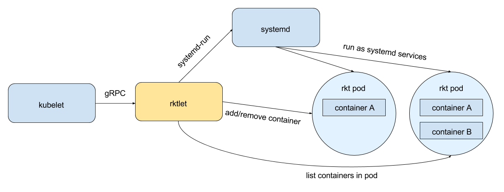

# Proposal: Design of the rkt + Kubernetes CRI

## Background

Currently, the Kubernetes project supports rkt as a container runtime via an implementation in the kubelet [here](https://github.com/kubernetes/kubernetes/tree/v1.3.6/pkg/kubelet/rkt).
This implementation, for historical reasons, has required implementing a large amount of logic shared by the original Docker implementation.

In order to make additional container runtime integrations easier, more clearly defined, and more consistent, a new [Container Runtime Interface](https://github.com/kubernetes/features/issues/54) (CRI) is being designed.
The existing runtimes, in order to both prove the correctness of the interface and reduce maintenance burden, are incentivized to move to this interface.

This document proposes how the rkt runtime integration will transition to using the CRI.

## Goals

### Full-featured

The CRI integration must work as well as the existing integration in terms of features. Until that's the case, the existing integration will continue to be maintained.

### Easy to Deploy

The new integration should not be any more difficult to deploy and configure than the existing integration.

### Easy to Develop

This iteration should be as easy to work and iterate on as the original one.

It will be available in an initial usable form quickly in order to validate the CRI.

## Design

rktlet works together with systemd and rkt to provide an implementation of the CRI to the Kubelet.

The Kubelet uses [gRPC](https://grpc.io/) to send requests to rktlet.
For example, pods are requested to be created by the Kubelet via calling the `RunPodSandbox()` CRI method.
rktlet will then start a systemd transient service calling `systemd-run` which will in turn create a new rkt sandbox by running the rkt binary with the [`app sandbox`](https://github.com/rkt/rkt/blob/v1.29.0/Documentation/proposals/app-level-api.md#rkt-app-sandbox) command.

After a sandbox is created, the Kubelet can request containers to be added to the pod (`CreateContainer()`), removed from the pod (`RemoveContainer()`), started (`StartContainer()`), and stopped (`StopContainer()`) among others.
rktlet will then run the rkt binary with the corresponding [`rkt app`](https://github.com/rkt/rkt/blob/v1.29.0/Documentation/proposals/app-level-api.md#rkt-app-add) commands (`app add`, `app rm`, `app start`, or `app stop`).

The rest of the CRI methods are also serviced by executing the rkt binary.

### Why exec the rkt binary?

While significant work on the rkt
[api-service](https://coreos.com/rkt/docs/latest/subcommands/api-service.html)
has been made, it has also been a source of problems and additional complexity,
and was never transitioned to entirely.

In addition, the rkt cli has historically been the primary interface to the rkt runtime. The initial integration will execute the rkt binary directly, other than for the `run` operation which will be parented by `systemd` (which will be assumed to exist in the initial implementation as well).

In the future, these decisions might be changed such that rkt is vendored as a library dependency for all operations, and run is refactored to work under other init systems.
